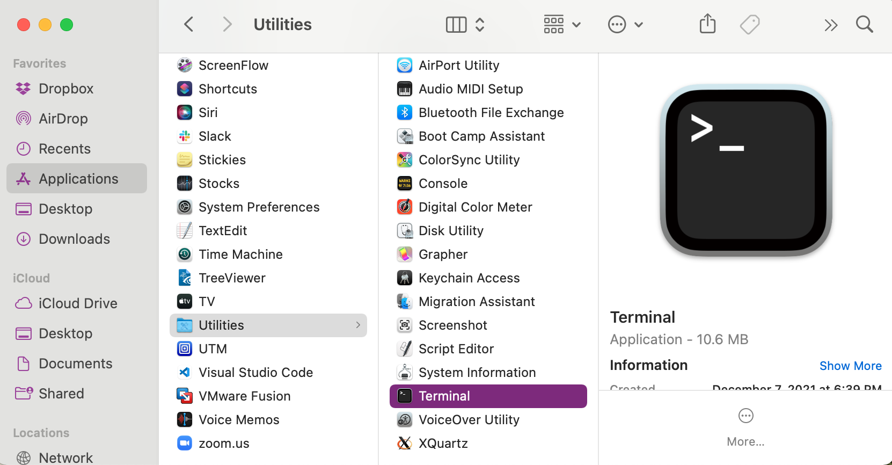
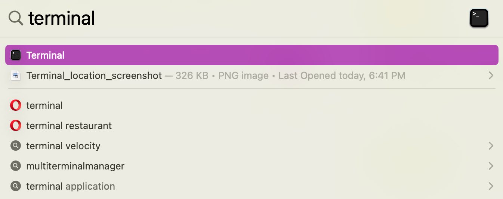

# Bash Setup

Bash, which is an acronym for Bourne-Again Shell, is a Unix shell and command language.  If you have never worked at the command line before, you may want to check out [this blog post](https://www.tenderisthebyte.com/blog/2019/12/15/beginning-bioinformatics-command-line-terminal/), especially the section about graphical vs. command line interfaces.

Please scroll to find your operating system for specific setup instructions.

## Windows

Windows does not come automatically equipped to run bash, but there are a couple of options to get it running on your machine.

**Option 1:** Windows Subsystem for Linux

If you are running Windows 10 version 2004 and higher (Build 19041 and higher) or Windows 11, Windows Subsystem for Linux (WSL) can be installed on your computer by following the instructions [here](https://docs.microsoft.com/en-us/windows/wsl/install).  Note that there is no need to change the default Linux distribution.

**Option 2:** Git for Windows

In addition to providing you with access to Git, Git for Windows also comes with a Bash emulation. You can download the installer [here](https://gitforwindows.org) and there are further instructions [here](https://carpentries.github.io/workshop-template/#shell) if you need them.

## MacOS

The default shell in MacOS is either Bash (older Macs) or zsh (newer Macs).  The two shells are highly similar and the differences will not matter for this bootcamp or for the workshop.  

To access Bash or zsh, you will need to open the [terminal](https://support.apple.com/guide/terminal/open-or-quit-terminal-apd5265185d-f365-44cb-8b09-71a064a42125/mac).  You can find the terminal application in `/Applications/Utilities`:

Or by using the Spotlight search feature:

Make sure that you can find and open your terminal!  If you're curious about your default shell, it should be listed in the top bar of the terminal.  Alternatively, type `echo $SHELL` in a terminal and press the Enter key.  If the message printed does not end with `/bash` then your default is something else and you can run Bash by typing bash.  However, zsh is also acceptable for this tutorial.

## Linux

The default shell is usually Bash and there is usually no need to install anything.

To see if your default shell is Bash type `echo $SHELL` in a terminal and press the Enter key. If the message printed does not end with `/bash` then your default is something else and you can run Bash by typing bash.
