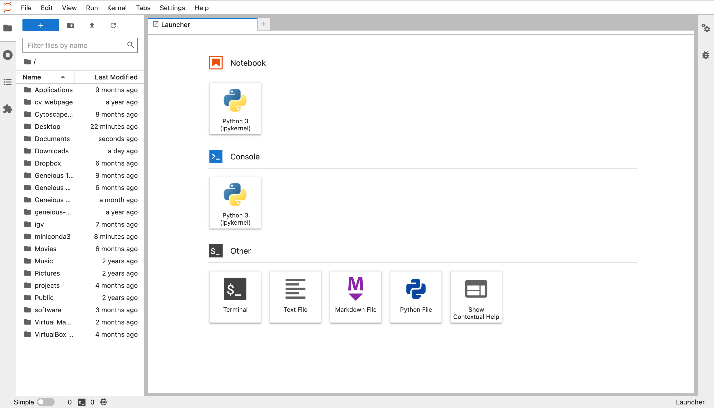

# Python Data Types

## JupyterLab

At this point, let's go ahead and open up JupyterLab.  The interpreter is fun to play with, but losing our things whenever we quit is not ideal.  We would like to preserve some of this.  

### Starting JupyterLab

If you have installed JupyterLab correctly, you should be able to launch it using:

```bash
~ $ jupyter lab
```

or 

```bash
~ $ jupyter-lab
```

This should automatically open a new window in your browser that looks something like this:



You will probably be in your home directory, like I am.  Double-click on the `Desktop` directory and make a new folder once you are there called something like `python_bootcamp`. Then, double-click on the new directory.

### Using a Jupyter Notebook

Now, open up a new jupyter notebook.  You can rename it if you would like by right-clicking either on the name on the tab or in the left-hand column.  I renamed mine `bootcamp.ipynb`.

Let's experiment with the blocks a bit.  You should start with a single empty block.  By default, this block should be code.  Try typing a math problem into it and hit the `run` button (triangle at the top that looks like a play button).  You should see the output appear below the box.

Make a new code block by hitting `+` at the top.  Then, make it a markdown block by using the drop down menu at the top that currently says "Code."  Move this box to the top of the notebook by hitting the `up` arrow in the top right of the block.  Then, enter this text:

```markdown
# This is a title

This is normal text
```

Now if you hit `run`, you will see the block replaced by the rendered version of the markdown text.  If you have not encountered markdown before, it's incredibly useful and you should [check it out](https://www.markdownguide.org/getting-started/).

Now that we can make new notebooks and run code in them, let's move on to data types.

## Data Types

We will not be discussing all python data types, just the most common ones and those that you will see in the AI/ML workshop.  For a deep dive into data types, check out [this article](https://realpython.com/python-data-types/).

### Numeric

Let's start with numbers, as we have seen them already.